# 2D-Lidar-DNN

This repository works as a learning process of implementing Deep Learning on estimating odometry of sequential 2D Lidar range data (two are used currently). 

## 1. Building datasets
To build the datasets: 
<ul>
<li>a. We brought up Kobuki robots equipped with laser scanners and ready for the rrt_exploration package using https://github.com/hasauino/rrt_exploration_tutorials.git. The robot settings are: laser collected at 10Hz, and it has 270 degrees FOV and 30m maximum range; the robot has a maximum translational velocity at 0.8m/s and rotational velocity at 0.5rad/s.</li>
<li>b. We used ROS package on RRT-based map exploration (git clone https://github.com/hasauino/rrt_exploration.git) to automatically navigating an unknown environment. </li>
<li>c. We created diverse Gazebo world files.</li>
<li>d. We collected the data in ROS by creating a package [ROS_data](https://github.com/heyday1006/SLAM_Study/Neural_Network_2dSLAM/ROS_data/README.md). And pose-process the data to range pairs in (2,1081) and robot transformations in (3,1). </li>
 <li>d1. Pose regression 
 We subsample the data to a frequency of {2Hz, 1Hz, 0.5Hz}. In total, there are more than 150k pairs for training+validation+testing (fraction: 0.99x0.85:0.99x0.15:0.01, see training environment) and 30k pairs for extra testing (see testing environment).

Training: 
 | Gazebo | Trajectory | Gazebo | Trajectory |
| ---| ---| --- | --- |
| simple wall  |  | custom office 2 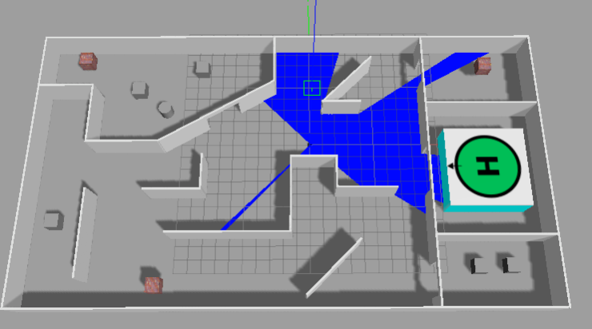 | 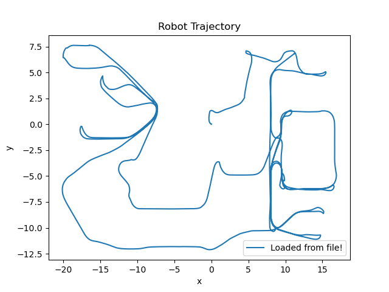 |
| cloister 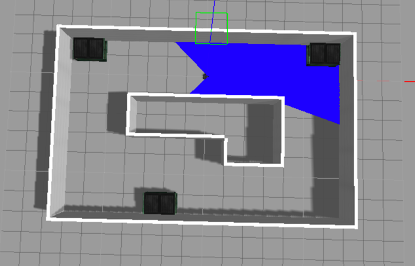 |  | MTR   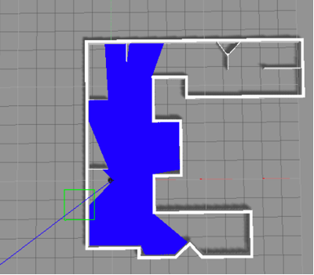 |  |
| house 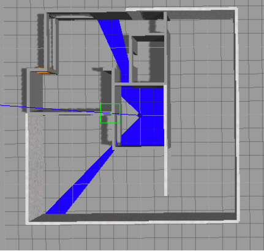 | 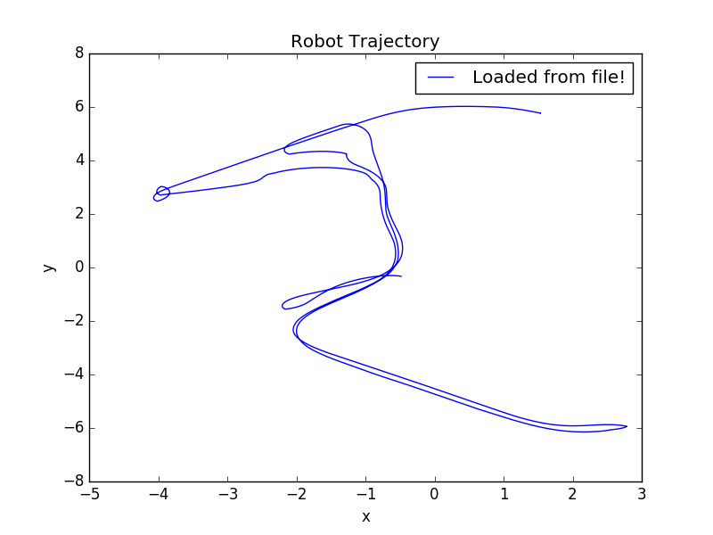 | large map   |  |
| custom office 3 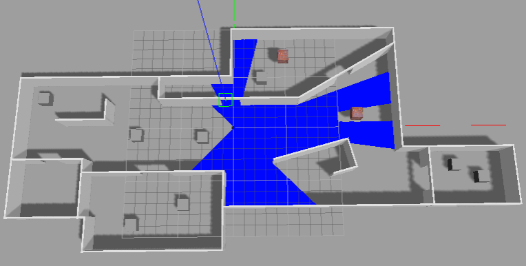 | 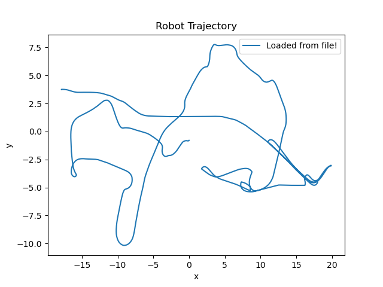 |translation distribution: 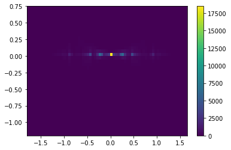|rotation distribution: 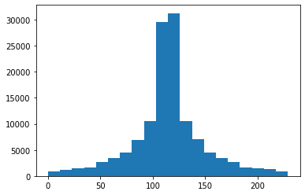|

Testing: 
 | Gazebo | Trajectory | Gazebo | Trajectory |
| ---| ---| --- | --- |
| simple wall  |  | custom wall1 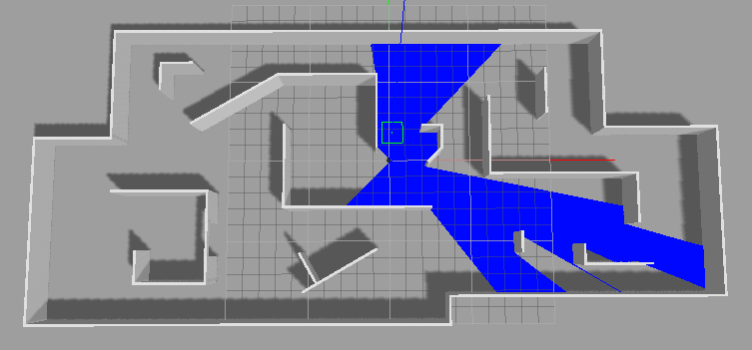 | 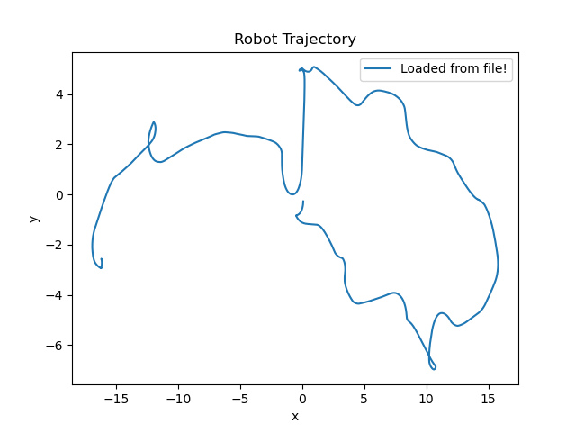 |
</li>

<li>d2. Closure Detection/Classification 
We subsample the data to a frequency of {2Hz,1Hz,0.5Hz,0.2Hz,0.1Hz,0.05Hz,0.002Hz}. We define the closure condition as: norm of the relative translation is less than 0.3m and the absolute value of the relative rotation is less than 100 degrees. There are more than 240k pairs for training+validation+testing(fraction: 0.99x0.85:0.99x0.15:0.01) and 40k for extra testing. Overall, the positive rate of the training dataset is 44.5%.
</li>
</ul>

## 2. Network Training 
<ul>
<li>a. Architecture [1] 

 

 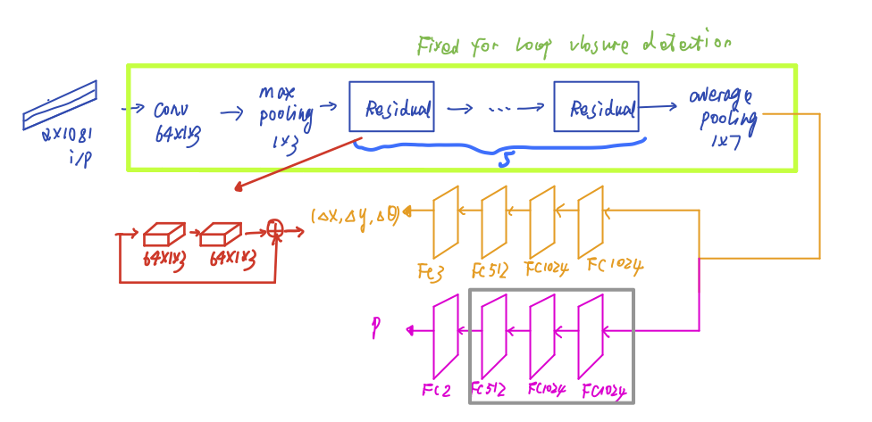
 
</li>
<li>b. Multi-task Regression for Relative Pose  
           We use the dataset created in Section 1.d1 to train the model. The loss weights are [10.0,0.05] (see 'Laser ResNet Loop Closure: Pose regression.ipynb').  When the extra testing range data is added with a noise (N(0,0.05^2)), the performance does not have much difference.  

| data | translation MSE| rotation MSE | translation MAE | rotation MAE |
| ---|---| ---| --- | --- |
|train|0.0027|1.3835|0.0316|0.7706|
|validation|0.0012|1.7641|0.0197|0.5844|
| test|0.0012 | 1.1057 |0.0197 | 0.5546|
|extra test|0.0210 |10.2893 | 0.0727 | 1.5643|
</li>
<li>c. Binary Classification for Loop Closure Detection  
           We use the dataset created in Section 1.d1 to train the model. The dataset has a positive rate of ~54%. We load the weights from Section 2.a to implement transfer learning. Here, the CNN weights are from (a1) and fixed, only fully connected layers are trained for detection purpose (see 'Laser ResNet Loop Closure: Detection.ipynb').  
           Given precision is (TP/(TP+FP)), recall is (TP/(TP+FN)), and AUC is the area under the ROC curve where x-axis is FPR, y-axis is TPR, the result is:  

| data | accuracy | precision | recall| AUC|
| ---|---| ---| --- | --- |
|train|0.9935 | 0.9928 | 0.9925 |0.9995|
|validation| 0.9812 |0.9755 | 0.9822 | 0.9950|
| test|0.0012 |  0.9820 | 0.9771 | 0.9819 | 0.9946|
|extra test| 0.9195 | 0.9156 |0.9264 | 0.9599 |
|extra test (FC512, 945k)|0.9170 | 0.9119 | 0.9254 | 0.9617|
|extra test (FC256, 470k)|0.9173 |0.9225 | 0.9134 | 0.9500|
|extra test (FC128, 280k)|0.9167 | 0.9208 | 0.9140 | 0.9547
</li>          
</ul>

## 3. Pose Graph Optimization

- Step1: use pose regressor model to collect the relative pose given a series of range measurements. Nx361x2  Nx3 in time step 2, 3, …, N. The estimate trajectory from only odometry (scan matching) can be obtained.

- Step2: use naïve method to create closure candidates: for every time step, collect all time indices after 20 steps. Then using closure detection model to find out the closures. In order to remove the outliers (wrong predicted closures), the estimate trajectory can be used to check. For these closure candidates, pose regressor model is used to find the relative pose. Problem: using this method to find closure candidates give very bad prediction results.

- Step3: add the relative constraints in Step1 and Step2 to the pose graph. Then optimize it.

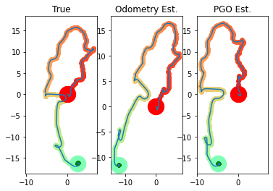

[1] J. Li, H. Zhan, B. M. Chen, I. Reid and G. H. Lee, "Deep learning for 2D scan matching and loop closure," 2017 IEEE/RSJ International Conference on Intelligent Robots and Systems (IROS), Vancouver, BC, 2017, pp. 763-768, doi: 10.1109/IROS.2017.8202236. 

